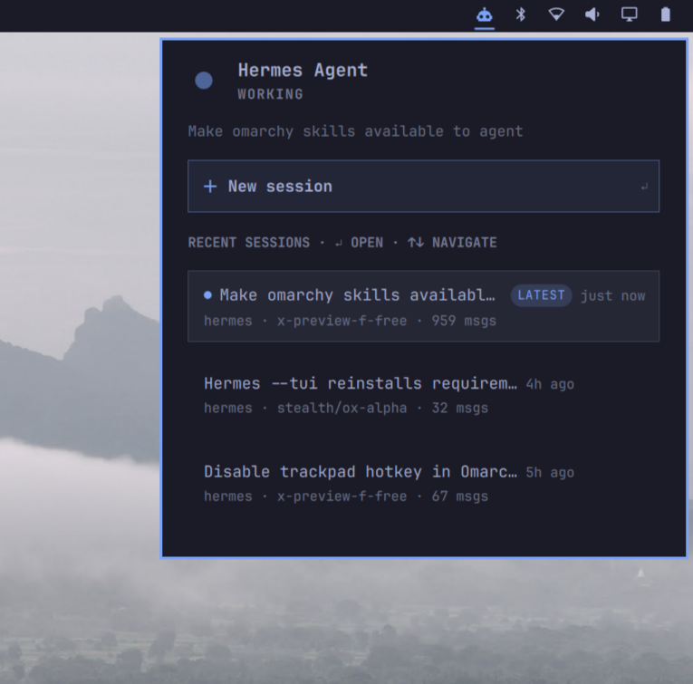

# Hermes Sessions for Omarchy

A bar widget that shows what your [Hermes Agent](https://hermes-agent.nousresearch.com) is doing — right now and historically — in the Omarchy status bar. Click any past session to continue it in a Hermes TUI terminal.




## Features

- **Live status** — a pulsing indicator shows when Hermes is actively working; the hero line names the current or most recent session
- **Bar icon reflects activity** — the icon tints with your theme's accent colour while Hermes is working, and returns to the normal foreground colour when idle
- **Recent sessions list** — title, relative age, workspace, model, and message count for your latest conversations
- **Click to continue** — each session opens (or re-focuses) its own terminal running `hermes --tui --resume <id>`
- **New session button** — one click launches a fresh Hermes TUI
- **Keyboard navigation** — `↑`/`↓` to move through sessions, `Enter` to open, `Esc` to close; the New-session button is reachable with arrows too
- **LATEST badge** — instantly spot the newest conversation, separate from the "currently live" dot

## Requirements

- Omarchy Linux (Hyprland + omarchy-shell)
- [Hermes Agent](https://hermes-agent.nousresearch.com) installed (`hermes` on PATH)
- `sqlite3` CLI (preinstalled on Omarchy)

## Install

```bash
omarchy plugin add https://github.com/stevequinn/omarchy-hermes-sessions.git
```

Then enable it and place it in the bar:

```bash
omarchy plugin enable kelso.hermes-sessions
omarchy bar put kelso.hermes-sessions --after omarchy.tray
```

(Or manage both via **Omarchy menu → Plugins**.)

## Uninstall

```bash
omarchy plugin disable kelso.hermes-sessions
omarchy plugin remove kelso.hermes-sessions
```

If you added the optional hotkey, remove its lines from
`~/.config/hypr/bindings.lua` and run `hyprctl reload`.

## Hotkey (optional)

To toggle the panel from anywhere, add this to `~/.config/hypr/bindings.lua`
and run `hyprctl reload`:

```lua
o.bind("SUPER + SHIFT + H", "Hermes sessions panel", "omarchy-shell kelso.hermes-sessions toggle")
```

## Settings

Right-click the bar icon or use the shell's plugin settings:

| Key | Default | Description |
|-----|---------|-------------|
| `refreshIntervalSec` | 30 | How often to poll the session store (10–600) |
| `sessionLimit` | 15 | Max sessions shown in the panel (5–50) |

## Privacy

Everything is local. The widget reads your Hermes session store (`~/.hermes/state.db`, SQLite) directly on your machine. No network calls, no telemetry.

## How it works

- `Panel.qml` — the bar icon and popup panel (Quickshell/QML, using Omarchy's shared UI components)
- `scripts/snapshot.sh` — queries the SQLite store and emits one JSON snapshot
- `scripts/hermes-tui-session` — tiny wrapper that resumes a session in the TUI (invoked inside a terminal provided by `omarchy-launch-tui`)

The widget collapses out of the bar entirely when no sessions exist.

## Troubleshooting

- **Icon missing**: no Hermes sessions found yet — chat with Hermes once and it appears
- **Stale info after editing files**: `omarchy restart shell` (plugin hot-reload occasionally serves a stale component)
- **Sessions don't open**: confirm `hermes --tui --resume <session-id>` works in a plain terminal

## License

MIT
